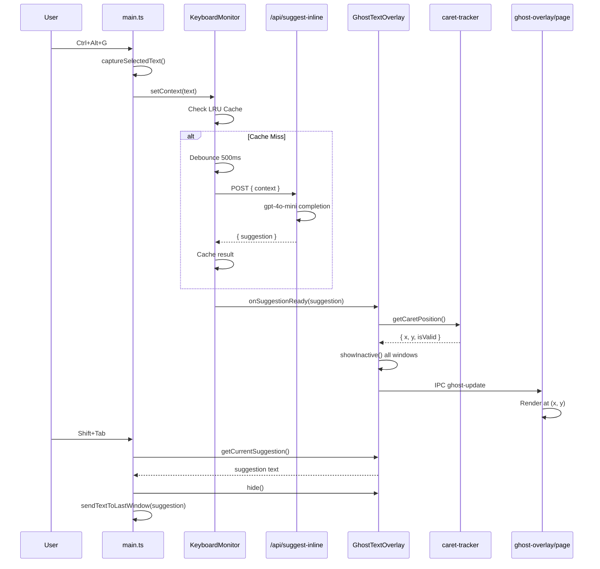
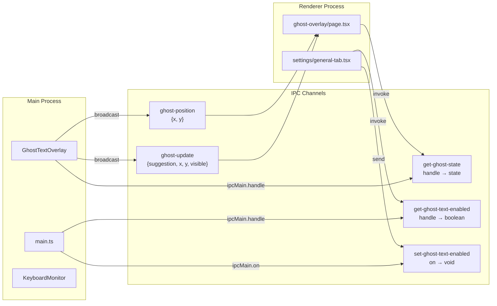

# Ghost Text Implementation

System-wide inline AI autocomplete that displays ghost text suggestions near the cursor position.

## Architecture Overview

```mermaid
flowchart TB
    subgraph User["User Interaction"]
        A[Ctrl+Alt+G] --> B[Capture Selected Text]
        K[Shift+Tab] --> L[Accept Suggestion]
        M[Shift+Escape] --> N[Dismiss]
    end

    subgraph Main["Electron Main Process"]
        B --> C[text-handler.ts<br/>captureSelectedText]
        C --> D[KeyboardMonitor<br/>setContext]
        D --> E{Cache Hit?}
        E -->|Yes| F[Return Cached]
        E -->|No| G[Debounce 500ms]
        G --> H[Fetch Suggestion]
        H --> I[GhostTextOverlay<br/>showSuggestion]
        L --> O[sendTextToLastWindow]
    end

    subgraph API["Next.js API"]
        H -->|POST| J[/api/suggest-inline<br/>gpt-4o-mini]
        J --> H
    end

    subgraph Caret["Position Tracking"]
        I --> P[caret-tracker.ts<br/>getCaretPosition]
        P --> Q[screen.getCursorScreenPoint]
        Q --> R[Position + Offset]
    end

    subgraph Overlay["Ghost Overlay Windows"]
        I --> S[BrowserWindow<br/>per display]
        S --> T[IPC: ghost-update]
        T --> U[/ghost-overlay page<br/>React Renderer]
    end

    subgraph Renderer["React Renderer"]
        U --> V[GhostOverlayPage]
        V --> W[Position at x,y]
        W --> X[Show Ghost Text + Hint]
    end

    F --> I
```

## Data Flow



## IPC Communication



## Files

### Electron Layer

| File                                                                                                                   | Purpose                                                |
| ---------------------------------------------------------------------------------------------------------------------- | ------------------------------------------------------ |
| [main.ts](file:///c:/Users/avina/Projects/RVCE/2026/ai-keyboard/frontend/electron/src/main.ts)                         | Global shortcuts, IPC handlers, orchestration          |
| [ghost-overlay.ts](file:///c:/Users/avina/Projects/RVCE/2026/ai-keyboard/frontend/electron/src/ghost-overlay.ts)       | Fullscreen transparent overlay windows (multi-monitor) |
| [keyboard-monitor.ts](file:///c:/Users/avina/Projects/RVCE/2026/ai-keyboard/frontend/electron/src/keyboard-monitor.ts) | Debouncing, LRU cache (25 entries), AbortController    |
| [caret-tracker.ts](file:///c:/Users/avina/Projects/RVCE/2026/ai-keyboard/frontend/electron/src/caret-tracker.ts)       | Cursor position tracking (mouse cursor fallback)       |

### React Layer

| File                                                                                                                        | Purpose                                  |
| --------------------------------------------------------------------------------------------------------------------------- | ---------------------------------------- |
| [page.tsx](file:///c:/Users/avina/Projects/RVCE/2026/ai-keyboard/frontend/src/app/ghost-overlay/page.tsx)                   | Renders ghost text at screen coordinates |
| [layout.tsx](file:///c:/Users/avina/Projects/RVCE/2026/ai-keyboard/frontend/src/app/ghost-overlay/layout.tsx)               | Transparent container layout             |
| [ghost-overlay.css](file:///c:/Users/avina/Projects/RVCE/2026/ai-keyboard/frontend/src/app/ghost-overlay/ghost-overlay.css) | Styling + fade-in animations             |
| [route.ts](file:///c:/Users/avina/Projects/RVCE/2026/ai-keyboard/frontend/src/app/api/suggest-inline/route.ts)              | Fast completions via gpt-4o-mini         |

### Types

| File                                                                                          | Addition                                                             |
| --------------------------------------------------------------------------------------------- | -------------------------------------------------------------------- |
| [electron.d.ts](file:///c:/Users/avina/Projects/RVCE/2026/ai-keyboard/frontend/electron.d.ts) | `on`, `removeListener`, `getGhostTextEnabled`, `setGhostTextEnabled` |

## Key Components

### GhostTextOverlay Class

- Creates one transparent `BrowserWindow` per display for multi-monitor support
- Windows are: `transparent`, `frameless`, `alwaysOnTop`, `focusable: false`, `click-through`
- Broadcasts state to all overlay windows via IPC
- Tracks cursor position every 50ms while visible

### KeyboardMonitor Class

- **LRU Cache**: 25 entries to avoid repeat API calls
- **Debounce**: 500ms wait after context changes (bypassed for manual trigger)
- **AbortController**: Cancels stale requests when context changes
- **Post-fetch validation**: Discards results if context changed during fetch

### Caret Tracker

Currently uses mouse cursor position as fallback:

```typescript
const cursorPoint = screen.getCursorScreenPoint();
return { x: cursorPoint.x + 5, y: cursorPoint.y + 20 };
```

## Shortcuts

| Key            | Action                                 |
| -------------- | -------------------------------------- |
| `Ctrl+Alt+G`   | Trigger ghost text (select text first) |
| `Shift+Tab`    | Accept suggestion and insert text      |
| `Shift+Escape` | Dismiss overlay                        |

## Settings

**Settings → General → Ghost Text Autocomplete** toggle

Persisted via IPC:

- `get-ghost-text-enabled` → returns current state
- `set-ghost-text-enabled` → enables/disables feature

## Window Properties

```typescript
new BrowserWindow({
  transparent: true,
  backgroundColor: "#00000000",
  frame: false,
  focusable: false, // Don't steal focus
  alwaysOnTop: true,
  skipTaskbar: true,
});
window.setIgnoreMouseEvents(true, { forward: true }); // Click-through
window.setAlwaysOnTop(true, "screen-saver", 1); // Above fullscreen
window.setVisibleOnAllWorkspaces(true); // All virtual desktops
```

## Current Limitations

1. **Manual trigger only** - Requires `Ctrl+Alt+G` (no real-time keystroke detection)
2. **Cursor position fallback** - Shows near mouse cursor, not actual text caret
3. **Single suggestion** - No streaming or incremental updates

## Future Improvements

- Real-time keystroke detection via `uiohook-napi`
- Actual caret position tracking via Windows Accessibility APIs (MSAA/UIA)
- Tab key acceptance without global shortcut conflicts
- Streaming suggestions for faster perceived response
